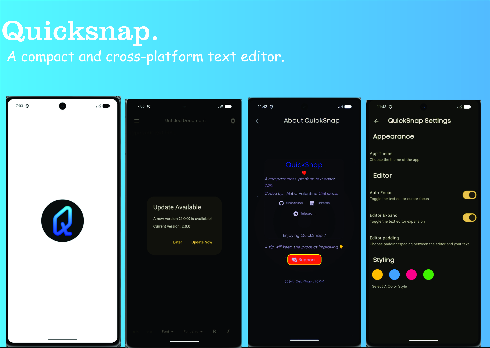

# QuickSnap

A simple but comprehensive cross-platform text and image vault for Android. QuickSnap lets you capture notes, organize them in one place, and access them offline — all secured with local encrypted storage.



---

## ✨ Features

- 📝 **Rich Text Editor** — powered by Flutter Quill with full formatting support
- 🖼️ **Image Vault** — store and view images securely in-app
- 🔒 **Offline-First** — local Hive + Flutter Secure Storage, no cloud dependency
- 🔐 **Privacy Focused** — biometric lock, encrypted local database
- 🎨 **Themes** — Light, Dark, and System theme support with custom accent colors
- 🌍 **Localized** — multi-language support
- ⚡ **Fast & Lightweight** — optimized performance with minimal footprint
- 🔄 **Auto-Updates** — built-in update checker with changelog support

---

## 📦 Download

Get the latest APK from the [GitHub Releases](https://github.com/val-en-tine124/quicksnap/releases) page.

| Architecture | When to Use |
|---|---|
| `arm64-v8a` | Most modern Android devices (64-bit) |
| `armeabi-v7a` | Older 32-bit Android devices |
| `X86_64` |  For 64-bit Intel or AMD processors Powered Device|

> **Note**: QuickSnap requires Android 8.0 (API 26) or higher.

---

## 🛠️ Build From Source

### Prerequisites

- [Flutter SDK](https://docs.flutter.dev/get-started/install) `>= 3.10.0`
- Android SDK / Xcode (for other platforms)
- A code editor (VS Code, Android Studio, etc.)

### Steps

```bash
# Clone the repository
git clone https://github.com/val-en-tine124/quicksnap.git
cd quicksnap

# Install dependencies
flutter pub get

# Generate code (Riverpod, Freezed, Hive adapters)
dart run build_runner build

# Run on a connected device / emulator
flutter run
```

### Build APK

```bash
flutter build apk --release --split-per-abi
```

Output will be in `build/app/outputs/flutter-apk/`.

---

## 🏗️ Architecture

```
lib/
├── features/           # Feature-based modules
│   ├── app_update/     # Update checking & release integration
│   ├── editor/         # Rich text editor (Flutter Quill)
│   ├── settings/       # App settings (theme, preferences)
│   └── save_to_db/     # Local persistence (Hive + Secure Storage)
├── styling/            # Theme definitions & color palettes
├── l10n/               # Localization files
└── utils/              # Reusable utilities

├── .github/
│   └── workflows/      # CI/CD (Android APK build & release)
│
└── test/               # Unit & widget tests
```

### Key Packages

| Package | Purpose |
|---|---|
| `flutter_riverpod` | State management |
| `flutter_quill` | Rich text editing |
| `hive_ce` | Local encrypted storage |
| `riverpod_annotation` + `build_runner` | Code generation (providers) |
| `freezed` | Immutable models |
| `dio` | HTTP client for update checks |
| `url_launcher` | Opening release URLs |

---

## 🤝 Contributing

Contributions are welcome! Please follow these steps:

1. Fork the repo
2. Create a feature branch: `git checkout -b feature/my-feature`
3. Make your changes and add tests
4. Ensure tests pass: `flutter test`
5. Ensure lint passes: `flutter analyze`
6. Commit: `git commit -m "feat: my feature"`
7. Push: `git push origin feature/my-feature`
8. Open a Pull Request

Please read [CONTRIBUTING.md](CONTRIBUTING.md) for more details.

---

## 📝 License

This project is licensed under the MIT License. See [LICENSE](LICENSE) for details.

---

## 🙌 Credits

Built with [Flutter](https://flutter.dev/). Special thanks to all open-source contributors whose packages make this app possible.